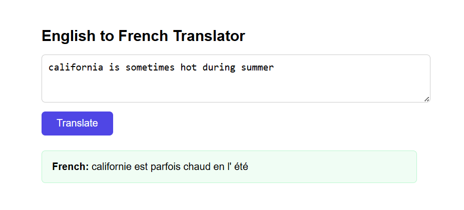

# English to French Translator

A machine learning web app that translates English sentences into French using a GRU-based neural network, served with Flask and containerized with Docker.

---

## Preview



---

## What the Model Does

The translation model is a RNN built with a GRU architecture. It was trained on a dataset of approximately 137,000 English-French sentence pairs.

The model pipeline works as follows:
1. The input English sentence is tokenized into integer sequences
2. The sequence is padded to a fixed length
3. The GRU network predicts the most likely French word at each position
4. The predicted tokens are decoded back into a French sentence

The model architecture:
- **Embedding layer** : converts word indices into 64-dimensional vectors
- **GRU layer** : 128 units, processes the sequence and captures context
- **Dense layer** : outputs a probability distribution over the French vocabulary (345 words)


## Project Structure

```
translation-app/
├── app.py                        # Flask application
├── translation_model.weights.h5  # Trained model weights
├── eng_tokenizer.pkl             # English tokenizer
├── fr_tokenizer.pkl              # French tokenizer
├── config.json                   # Max sequence length config
├── requirements.txt              # Python dependencies
├── Dockerfile                    # Docker container definition
└── templates/
    └── index.html                # Web interface
```

## Running Locally with Docker

### Prerequisites
- [Docker](https://www.docker.com/products/docker-desktop) installed on your machine

### Steps

1. Clone the repository:
```bash
git clone https://github.com/username/translation-app.git
cd translation-app
```

2. Build the Docker image:
```bash
docker build -t translation-app .
```

3. Run the container:
```bash
docker run -p 5000:5000 translation-app
```

4. Open your browser and go to:
```
http://localhost:5000
```

## How to Use the Interface

1. Type an English sentence into the text box
2. Click the **Translate** button
3. The French translation will appear below

**Example inputs that work well:**
- `california is sometimes hot during summer`
- `paris is quiet during winter`
- `he likes apples and oranges`
- `the united states is usually cold in january`

## Live Demo (Deployment)

The app is live and accessible at:
[link](link)

## Known Issues and Limitations

- **Limited vocabulary** : the model was trained on a small, repetitive dataset of around 227 unique English words focused on weather, locations, fruits, and animals. It does not generalize to everyday English.
- **Out-of-vocabulary words** : if you type a word the model has never seen (e.g. "hello"), it will return no translation or a nonsensical one.
- **Short sentences work best** : the model was trained on sentences averaging 14 words. Very long sentences may produce poor results.
- **No GPU in Docker** : the container runs on CPU only, so the first prediction may take a second or two.

## Built With

- [TensorFlow / Keras](https://www.tensorflow.org/) : model training and inference
- [Flask](https://flask.palletsprojects.com/) : web framework
- [Docker](https://www.docker.com/) : containerization

## Author

Nada Elhag and I made as part of the ZAKA AI Machine Learning Specialization.
